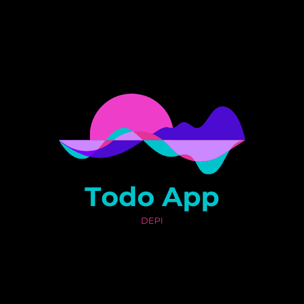

<p align="center">
   
</p>

<h1 align="center">✅ Todo App (DEPI Task)</h1>
<p align="center">A cross-platform Todo Application built with Flutter & Firebase</p>

<p align="center">
  
  
  
  
</p>

---

## ✨ Features

- 🔐 **Authentication** – Secure login & signup with Firebase Authentication  
- 📝 **Todo Management** – Create, update, delete, and mark tasks as complete  
- 📡 **Cloud Firestore** – Store and sync todos in real-time  
- 🔄 **State Management** – Powered by Flutter **Bloc** for predictable state flow  
- 🏗 **Clean Architecture** – Organized layers for testability and scalability  

---

## 🛠 Technologies Used

- **Flutter** – Cross-platform UI toolkit  
- **Firebase** – Authentication & Cloud Firestore  
- **Flutter Bloc** – State management with BLoC pattern  
- **Clean Architecture** – Modular and maintainable code  

---

## 🚀 Installation & Setup

### Prerequisites
- Flutter SDK (v3.x.x or higher)  
- Dart SDK (comes with Flutter)  
- Firebase CLI  

### Steps
```bash
# 1. Clone the repository
git clone https://github.com/AhmedAbdelaal345/Todo_App_DEPI.git
cd Todo_App_DEPI

# 2. Install dependencies
flutter pub get

# 3. Configure Firebase
npm install -g firebase-tools
firebase login
flutterfire configure

# 4. Run the application
flutter run
📂 Project Structure
bash
Copy code
lib/
├── manager/             # BLoC (cubits & states)
├── model/               # Data models
├── pages/               # UI Screens
├── helper/              # Reusable widgets
├── firebase_core/       # Firebase config
├── constants.dart       # App constants
└── main.dart            # Entry point
📸 Screenshots
Authentication Flow
Get Started	Login	Register
		

Todo Management
Pending Tasks	Completed Tasks	Profile
		

Splash & Refresh
Refresh	Splash 2	Splash 3
		

📅 Project Info
Developed as part of DEPI Program

Timeline: 1 Week

Status: ✅ Completed

📥 Download
👉 Download APK (Upload to GitHub Releases or Google Drive and update this link)

📌 License
This project is licensed under the MIT License.
